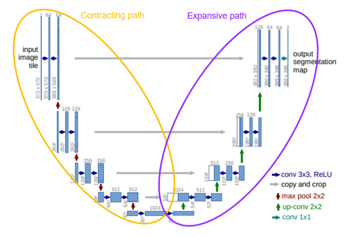

# Segmentation-project-TFG

## Study on the application of different image preprocessing algorithms in image segmentation using deep learning techniques

### Abstract
Semantic segmentation is one of the most important fields of computer vision due to its applicability. In this case, semantic segmentation will be applied to images taken from vehicles knowing the importance of autonomous driving for our future. 

This project aims to achieve precise and fast results in the field of semantic segmentation with the complication of using less powerful and more affordable hardware than the one used nowadays. 

Deep learning techniques will be used to solve this problem. More concretely, a specific model of convolutional neural network will be trained and in charge of making the predictions, a U-Net. 

Different parameters of the U-Net will be changed to study how they affect the results. Furthermore, various image sizes, color spaces or reduction methods will be applied to study their impact on the speed and accuracy of the U-Net predictions. 

Finally, all those results will be compared in order to make a final decision in which is the best combination and which fields impact the most and how.

### Model: U-Net


### Conclusions and future lines
In this project we have developed an in-depth study on different processes that allow to reduce the computational cost on deep convolutional neural network, UNet in this case.  

According to the results, not always more complex methods obtain the best outcome for every application. Even though they can obtain more accurate predictions, in some cases, like self-driving vehicles where speed is key, simpler and faster methods are better. 

Taking into account this consideration, we have chosen bilinear interpolation as image reduction method as it is much faster than sliding window. We have also seen that 3 steps U-Net architectures are faster than 4 steps, but they obtain less accurate results. Anyway, speed gain is much more considerable than IOU loss (11.3% speed gain vs 1.88% mean IOU loss in RGB 3 steps U-Net).

In the future, we expect to continue analyzing more preprocessing methods that allow to maintain or increase speed without losing or even improving accuracy (mean IOU). Some of the new methods to apply could be color correction processes such as gamma correction or other image reduction techniques. 

Another aspect to consider would be postprocessing. As it can be observed in the last image, some pixel predictions are far to be correct. This could be fixed by applying postprocessing methods always keeping in mind that speed is key.

One last consideration would be using better hardware. This will allow more testing and more comparisons, but remembering the importance of accessible hardware. 

### Extra aspects
- Some results can be seen in ```/graphs``` folder.
- Train and test scripts provided.
